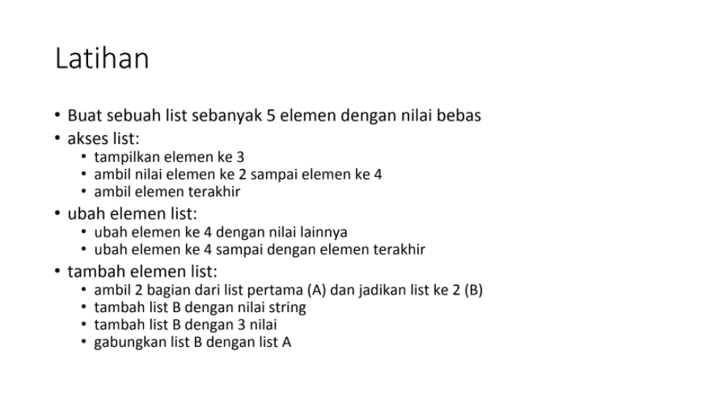
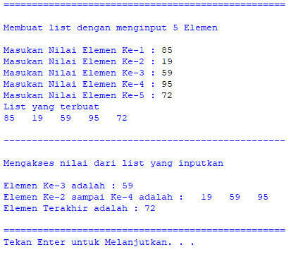
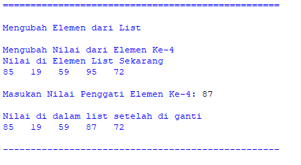
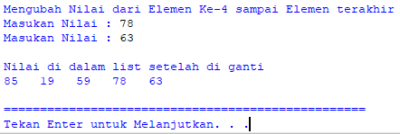
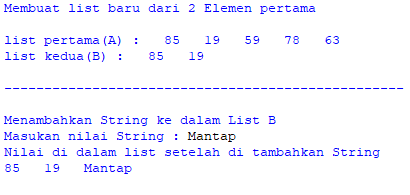
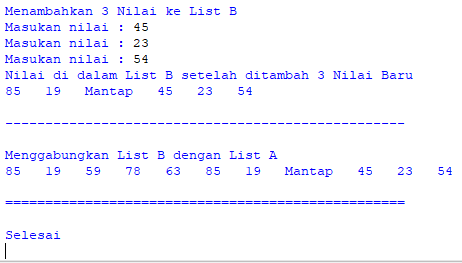

# Iman Setiawan

**Tugas Latihan - Pertemuan 9**\
**Materi List, Tuple, dan Dictionary**

Berikut soal tugas dari modul.\

Ini adalah code pyhton saya\
Saya juga telah melampirkan filenya
~~~

print("="*50)
print()
print("Membuat list dengan menginput 5 Elemen")
print()

list = []
nilai1 = input("Masukan Nilai Elemen Ke-1 : ")
nilai2 = input("Masukan Nilai Elemen Ke-2 : ")
nilai3 = input("Masukan Nilai Elemen Ke-3 : ")
nilai4 = input("Masukan Nilai Elemen Ke-4 : ")
nilai5 = input("Masukan Nilai Elemen Ke-5 : ")
list = [nilai1,nilai2,nilai3,nilai4,nilai5]
print("List yang terbuat")
print(*list,sep= "   ")
print()

print("-"*50)
print()
print("Mengakses nilai dari list yang inputkan")
print()
print("Elemen Ke-3 adalah :" ,list[2])
print("Elemen Ke-2 sampai Ke-4 adalah :", *list[1:4],sep= "   ")
print("Elemen Terakhir adalah :" ,list[-1])
print()

print("="*50)
input("Tekan Enter untuk Melanjutkan. . .")
##############################################################
print("="*50)
print()
print("Mengubah Elemen dari List")
print()
print("Mengubah Nilai dari Elemen Ke-4")
print("Nilai di Elemen List Sekarang")
print(*list,sep= "   ")
print()
list[3] = input("Masukan Nilai Penggati Elemen Ke-4: ")
print()
print("Nilai di dalam list setelah di ganti")
print(*list,sep= "   ")
print()

print("-"*50)
print()
print("Mengubah Nilai dari Elemen Ke-4 sampai Elemen terakhir")
list[3] = input("Masukan Nilai : ")
list[4] = input("Masukan Nilai : ")
print()
print("Nilai di dalam list setelah di ganti")
print(*list,sep= "   ")
print()

print("="*50)
input("Tekan Enter untuk Melanjutkan. . .")
############################################################
print("="*50)
print()
print("Membuat list baru dari 2 Elemen pertama")
print()
list2 = list[0:2]
print("list pertama(A) :",*list,sep= "   ")
print("list kedua(B) :",*list2,sep= "   ")
print()
print("-"*50)
print()
print("Menambahkan String ke dalam List B")
xb = input("Masukan nilai String : ")
list2.append(xb)
print("Nilai di dalam list setelah di tambahkan String")
print(*list2,sep= "   ")
print()

print("-"*50)
print()
print("Menambahkan 3 Nilai ke List B")
nb1 = input("Masukan nilai : ")
list2.append(nb1)
nb2 = input("Masukan nilai : ")
list2.append(nb2)
nb3 = input("Masukan nilai : ")
list2.append(nb3)
print("Nilai di dalam List B setelah ditambah 3 Nilai Baru")
print(*list2,sep= "   ")
print()

print("-"*50)
print()
print("Menggabungkan List B dengan List A")
listab = list + list2
print(*listab,sep= "   ")
print()
print("="*50)
print()
print("Selesai")

~~~

Membuat List dengan memasukan 5 Nilai\
Nilai yang di input adalah 85, 19, 59, 95, dan 72\
Menampilkan listnya\
Mengakses nilai list seperti disoal.\

Mengubah elemen ke-4 dari list dan menampilkannya\
Dengan input 87.\

Mengubah elemen ke-4 sampai elemen terakhir\
Dengan input 78 dan 63\

Membuat list dengan 2 elemen dari list pertama\
Dan menampilkannya\
Menabahkan nilai baru kedalam List Kedua(B) dengan nilai String\
Dengan input "Mantap"\

Menambakan 3 Nilai baru kedalam list kedua(B)\
Dengan input 45, 23, dan 54\

